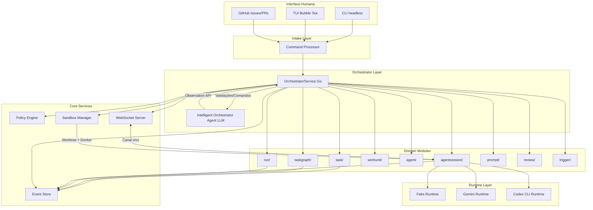

# Análise Completa de Arquitetura - OrchestraOS

**Data:** 2026-05-13  
**Status:** Análise Concluída

---

## 1. Resumo Executivo

O OrchestraOS está em transição de uma arquitetura em camadas (Layered Architecture) para uma arquitetura de **Módulos Verticais (Vertical Slices)**, conforme ADR 0022. Esta mudança é fundamental para otimizar o sistema para operação por agentes de IA (LLMs), reduzindo contexto desnecessário e aumentando escalabilidade.

O projeto está **adiantado** em relação à documentação em alguns aspectos, mas ainda possui gaps significativos em componentes críticos como TUI, Sandbox real, Policy Engine e Memória Recursiva.

---

## 2. Arquitetura Proposta (ADRs e Documentação)

### 2.1. Decisões Arquiteturais Fundamentais

#### ADR 0001: Repositório como Fonte de Verdade
- GitHub como camada operacional externa
- Documentos versionados como fonte definitiva
- Chat não deve virar arquivo morto de decisões

#### ADR 0002: Orchestrator como Control Plane
- Orchestrator central como mediador de TODA comunicação
- Agentes como workers isolados
- Comunicação cross-module OBRIGATORIAMENTE via Orchestrator
- WebSocket para canal vivo, Event Store para persistência

#### ADR 0022: Módulos Verticais (Vertical Slice Architecture)
- **Mudança crítica:** De camadas técnicas para módulos por domínio
- Cada módulo é autônomo: `internal/modules/<entity>/`
- **Regra de Ouro:** Módulos NUNCA importam outros módulos diretamente
- Comunicação via `internal/core/coordination` ou interfaces DI

#### ADR 0023: Hybrid Intelligent Orchestrator
- **Sistema Go Determinístico:** OrchestratorService como gatekeeper
- **Sistema LLM Estratégico:** Agente Orquestrador Inteligente
- Separação clara: Go executa e valida, LLM sugere estratégias
- Observation API controlada para expor resumos ao LLM

### 2.2. Stack Tecnológica (ADR 0003)

| Camada | Escolha | Status |
|--------|---------|--------|
| Orchestrator | Go | ✅ Implementado |
| Persistência | Postgres | ✅ Implementado |
| Canal agente-orquestrador | WebSocket | ⚠️ Parcial (relay implementado, WS pendente) |
| Fila/eventos | Postgres outbox → NATS JetStream | ✅ MVP (outbox), ⚠️ NATS futuro |
| Runtime de agentes | Codex/CLI + Gemini | ✅ Fake/Gemini, ⚠️ Codex pendente |
| Isolamento | Git worktree + Docker | ⚠️ Sandbox pendente |
| Sandbox reforçado | gVisor/Firecracker | ❌ Futuro |
| Interface | Scripts → CLI → TUI | ✅ CLI, ⚠️ TUI pendente |
| Painel web | TypeScript + React | ❌ Futuro |

### 2.3. Entidades do Domínio (Domain Model)

**Entidades Principais:**
- Task, TaskGraph, WorkUnit, Dependency
- Run, Agent, AgentSession, AgentCheckpoint
- MemoryRecord, RetrievedMemoryBundle
- Sandbox, ToolDefinition, ToolRequest, ToolExecution
- Policy, Approval, Event, TraceSpan, LogEntry, Artifact
- PromptFragment, DynamicPromptFragment, PromptSnapshot, ToolsetSnapshot
- AgentTaskLedger, Review, MergeDecision

**Fronteiras:**
- Intake, Orchestration, Planning, Prompting
- Agent Runtime, Policy, Tracing, Memory, Review

---

## 3. Implementação Atual

### 3.1. Estrutura de Diretórios

```
OrchestraOS/
├── cmd/orchestraos/          # CLI (8 itens)
├── internal/
│   ├── bootstrap/            # DI e wiring de serviços (2 itens)
│   ├── core/                 # Componentes compartilhados (39 itens)
│   │   ├── apperrors/        # Tipagem de erros
│   │   ├── db/               # Helpers de transação
│   │   ├── event/            # EventService
│   │   ├── eventstore/       # Event Store (append, replay)
│   │   ├── orchestration/    # Helpers de transição cross-module
│   │   ├── serialization/    # Marshalling de payloads
│   │   ├── statemachine/     # Regras de state machine
│   │   ├── transition/       # Payload builders
│   │   └── validation/       # Validadores compartilhados
│   ├── domain/               # Tipos compartilhados (4 itens)
│   │   ├── checkpoint.go     # Tipos de checkpoint
│   │   ├── doc.go
│   │   ├── event_payloads.go # Payloads de eventos
│   │   └── types.go          # Task, Run, WorkUnit, Agent, AgentSession
│   ├── migrations/           # Migrations goose (1 item)
│   └── modules/              # MÓDULOS VERTICAIS (144 itens)
│       ├── agent/            # Agent + Runtimes (Fake, Gemini) (16 itens)
│       ├── agentsession/     # Ciclo de vida de sessões (13 itens)
│       ├── orchestrator/     # OrchestratorService (5 itens)
│       ├── prompt/           # Prompt Composer + catálogo (36 itens)
│       ├── review/           # Gates de revisão (10 itens)
│       ├── run/              # Tentativas de execução (12 itens)
│       ├── task/             # Tasks (11 itens)
│       ├── taskgraph/        # Task Graph + Planner (14 itens)
│       ├── trigger/          # Detecção de anomalias (14 itens)
│       └── workunit/         # Work units (13 itens)
├── contracts/                # JSON Schemas
├── migrations/               # SQL migrations (15+ arquivos)
├── tests/                    # Testes de arquitetura e integração
└── docs/                     # ADRs, arquitetura, canvas
```

### 3.2. Módulos Verticais Implementados

**Cada módulo segue o padrão:**
```
internal/modules/<entity>/
├── CONTRACTS.md              # Invariants e regras críticas
├── README.md                 # Propósito, responsabilidades, dependências
├── doc.go                    # Documentação de pacote
├── models.go                 # Tipos específicos do módulo
├── service.go                # Lógica de domínio
├── repository.go             # Acesso a dados
├── queries.go                # SQL constants
├── validation.go             # Validadores de entrada
├── events.go                 # Mapeamento de eventos
├── contract.go               # Interfaces para DI
└── *_test.go                 # Testes
```

**Módulos Atuais:**
1. **agent/**: Agent entities, FakeRuntime, GeminiRuntime, GeminiPlanner
2. **agentsession/**: Ciclo de vida de sessões, heartbeat, checkpoint, timeout
3. **orchestrator/**: OrchestratorService (coordena fluxo end-to-end)
4. **prompt/**: Prompt Composer, catálogo de fragmentos versionados
5. **review/**: Gates de revisão e validação
6. **run/**: Tentativas de execução, retry, timeout
7. **task/**: Tasks, triagem, planejamento
8. **taskgraph/**: Task Graph, decomposição (local + LLM)
9. **trigger/**: Detecção de anomalias (stalls, loops)
10. **workunit/**: Work units, dependências, ownership

### 3.3. Padrão de Comunicação Cross-Module

**Regra de Ouro (ADR 0022):**
> Nenhum módulo pode importar diretamente outro módulo. Comunicação via `internal/core/coordination` ou interfaces DI.

**Exemplo de Implementação (bootstrap/services.go):**
```go
// Adapters bridge module types → orchestrator-local interfaces
type taskAdapter struct {
    db  *sql.DB
    svc *taskmod.TaskService
}

func (a *taskAdapter) GetByID(ctx context.Context, id string) (*domain.Task, error) {
    return taskmod.NewRepository(a.db).GetByID(id)
}
```

**Componentes de Orquestração Compartilhados (internal/core/coordination):**
- `TransitionInput`: Payload builder para transições
- `OperationResult[T]`: Wrapper genérico (value + event + duplicate)
- `RuntimeEventRelay`: Relay eventos de runtime para serviços
- `PromptOrchestrator`: Coordena montagem de prompts

---

## 4. Gaps Identificados

### 4.1. Documentação vs Implementação

| Documentação | Implementação | Gap |
|--------------|---------------|-----|
| `internal/services/` | `internal/modules/` | ✅ **Migração concluída** (ADR 0022) |
| Orchestrator como agente LLM puro | OrchestratorService Go + adapters | ✅ **Corrigido** (ADR 0023) |
| CLI fina | CLI implementada | ✅ Implementada |
| TUI como interface principal | Apenas CLI | ❌ **PENDENTE** (ADR 0015) |
| Sandbox com worktree + Docker | Apenas FakeRuntime | ❌ **PENDENTE** |
| Policy Engine | Não implementado | ❌ **PENDENTE** |
| Memória Recursiva | Não implementado | ❌ **PENDENTE** (ADR 0012) |
| WebSocket real | Relay implementado, WS pendente | ⚠️ **PARCIAL** |
| Runtime Codex/CLI real | Apenas Fake/Gemini | ⚠️ **PARCIAL** |
| GitHub integration | Parcial | ⚠️ **PARCIAL** |

### 4.2. Documentação Desatualizada

**Arquivos que precisam de atualização:**
- `docs/architecture/core/repo-structure.md`: Ainda fala de `internal/services/`
- `docs/architecture/README.md`: Diagrama não reflete módulos verticais
- ADRs 0017, 0020, 0021: Referenciam `internal/services/` que não existe mais

**Sugestão:** Criar documento de migração explicando a transição para Vertical Slices.

### 4.3. Componentes Críticos Pendentes

**Prioridade ALTA (bloqueiam MVP funcional):**
1. **TUI (ADR 0015):** Interface principal para operação local
2. **Sandbox Real:** Worktree + Docker por task
3. **WebSocket:** Canal bidirecional vivo agente-orchestrator
4. **Policy Engine:** Validação de ferramentas e permissões

**Prioridade MÉDIA (melhoriam experiência):**
5. **Runtime Codex/CLI:** Runtime real de agentes
6. **GitHub Integration:** Issues, PRs, checks automatizados
7. **RuntimeEventRelay:** Já implementado, precisa integração WS

**Prioridade BAIXA (evolução pós-MVP):**
8. **Memória Recursiva (ADR 0012):** Recuperação de contexto
9. **NATS JetStream:** Filas duráveis
10. **gVisor/Firecracker:** Sandbox reforçado
11. **Painel Web:** TypeScript + React

### 4.4. Gaps de Testes

- Testes E2E completos (Task → Graph → Run → AgentSession → Runtime → Complete)
- Testes de integração de TUI
- Testes de Sandbox real
- Testes de Policy Engine
- Testes de WebSocket
- Testes de paralelismo de agentes

---

## 5. Arquitetura Final Escalável

### 5.1. Estrutura de Diretórios Final

```text
OrchestraOS/
├── cmd/
│   ├── orchestraos/              # CLI headless (automação, testes)
│   │   └── cmd/
│   │       ├── task.go
│   │       ├── run.go
│   │       ├── agent.go
│   │       └── ...
│   └── orchestraos-tui/          # TUI principal (Bubble Tea)
│       ├── app.go
│       ├── pages/
│       │   ├── dashboard.go
│       │   ├── tasks.go
│       │   ├── runs.go
│       │   ├── events.go
│       │   └── approvals.go
│       └── components/
│           ├── tables.go
│           ├── forms.go
│           └── ...
├── internal/
│   ├── bootstrap/                # DI e wiring
│   │   ├── services.go           # Domain services
│   │   ├── tui.go                # TUI wiring
│   │   └── websocket.go         # WebSocket wiring
│   ├── core/                     # Componentes compartilhados
│   │   ├── apperrors/
│   │   ├── db/
│   │   ├── event/
│   │   ├── eventstore/
│   │   ├── orchestration/
│   │   ├── serialization/
│   │   ├── statemachine/
│   │   ├── transition/
│   │   ├── validation/
│   │   ├── websocket/            # NOVO: WebSocket server
│   │   ├── sandbox/              # NOVO: Sandbox manager
│   │   └── policy/               # NOVO: Policy engine
│   ├── domain/                   # Tipos compartilhados
│   │   ├── checkpoint.go
│   │   ├── event_payloads.go
│   │   ├── types.go
│   │   └── ...
│   ├── modules/                  # Módulos verticais (autônomos)
│   │   ├── agent/
│   │   ├── agentsession/
│   │   ├── orchestrator/
│   │   ├── prompt/
│   │   ├── review/
│   │   ├── run/
│   │   ├── task/
│   │   ├── taskgraph/
│   │   ├── trigger/
│   │   ├── workunit/
│   │   ├── memory/               # NOVO: Memoria recursiva
│   │   ├── policy/               # NOVO: Policy module
│   │   ├── sandbox/              # NOVO: Sandbox module
│   │   └── github/               # NOVO: GitHub integration
│   └── runtime/                  # Runtimes de agentes
│       ├── fake.go
│       ├── gemini.go
│       ├── codex_cli.go          # NOVO: Runtime real
│       └── external.go
├── contracts/                    # JSON Schemas
├── migrations/                   # SQL migrations
├── tests/
│   ├── architecture/             # Testes de contrato
│   ├── integration/              # Testes E2E
│   └── e2e/                      # Testes completos
└── docs/
    ├── adr/                      # Architecture Decision Records
    ├── architecture/             # Documentação técnica
    ├── canvas/                   # Project canvas
    └── analysis/                 # Análises (este arquivo)
```

### 5.2. Fluxo de Dados Completo



### 5.3. Regras de Escalabilidade

#### Para Adicionar Nova Funcionalidade:

1. **Criar novo módulo vertical:**
   ```bash
   ./scripts/new-module.sh <nome>
   ```
   Isso gera estrutura padronizada em `internal/modules/<nome>/`

2. **Definir contratos:**
   - `CONTRACTS.md`: Invariants, state machine, regras
   - `README.md`: Propósito, responsabilidades, dependências
   - `contract.go`: Interfaces para DI

3. **Implementar camadas:**
   - `models.go`: Tipos específicos
   - `service.go`: Lógica de domínio
   - `repository.go`: Acesso a dados
   - `validation.go`: Validadores

4. **Wiring no bootstrap:**
   - Adicionar factory em `bootstrap/services.go`
   - Criar adapters se necessário para cross-module

5. **Testes:**
   - Testes de unidade do módulo
   - Testes de contrato
   - Testes de integração E2E

#### Regras de Crescimento:

- **Cada nova feature = novo módulo vertical**
- **Nunca editar módulos existentes** exceto para correções
- **Comunicação cross-module via core/coordination**
- **Tipos compartilhados em internal/domain**
- **Helpers compartilhados em internal/core**

### 5.4. Padrão de Adição de Módulos

**Exemplo: Adicionar módulo `github/`**

```go
// internal/modules/github/contract.go
package github

import "context"

type IssueCreator interface {
    CreateIssue(ctx context.Context, input CreateIssueInput) (*Issue, error)
}

type PRManager interface {
    CreatePR(ctx context.Context, input CreatePRInput) (*PR, error)
    GetPRStatus(ctx context.Context, prID string) (PRStatus, error)
}

// internal/modules/github/service.go
type GitHubService struct {
    db  *sql.DB
    client *github.Client
}

func (s *GitHubService) CreateIssue(ctx context.Context, input CreateIssueInput) (*Issue, error) {
    // Lógica de domínio
    // Emitir evento github.issue_created
}

// bootstrap/services.go
func GitHubService(db *sql.DB, token string) *githubmod.GitHubService {
    client := github.NewClient(token)
    return githubmod.NewGitHubService(db, client)
}
```

### 5.5. Evolução para Microsserviços (Futuro)

A arquitetura de módulos verticais **facilita extração para microsserviços**:

1. **Identificar módulo candidato:** Ex: `internal/modules/memory/`
2. **Mover pasta para repositório separado**
3. **Criar API gRPC/REST** baseada em `contract.go`
4. **Atualizar adapters no bootstrap** para chamadas remotas
5. **Migrar dados** se necessário

**Vantagem:** Módulos já são autônomos, sem dependências diretas entre si.

---

## 6. Próximos Passos Prioritários

### Fase I: Completar MVP Funcional (1-2 semanas)

1. **TUI Implementation (ADR 0015)**
   - Implementar TUI com Bubble Tea
   - Dashboard de tasks/runs/eventos
   - Live view de sessões de agente
   - Aprovações de ferramentas
   - Comandos guiados

2. **Sandbox Real**
   - Git worktree por task
   - Container Docker isolado
   - Montagem de paths aprovados
   - Limites de recursos
   - Política de rede

3. **WebSocket Server**
   - Implementar servidor WebSocket em `internal/core/websocket/`
   - Integrar com AgentSession
   - Relay de eventos em tempo real
   - Reconexão automática

4. **Policy Engine Básico**
   - Validação de ferramentas por risco
   - Auto-aprovação de tools safe
   - Escalonamento para humano em risco alto
   - Integração com Orchestrator

### Fase II: Integração GitHub (1 semana)

5. **GitHub Integration Module**
   - Criar issues a partir de tasks
   - Criar PRs automaticamente
   - Reportar status via checks
   - Integrar revisões humanas

6. **Runtime Codex/CLI**
   - Implementar runtime real
   - Integração com sandbox
   - Testes E2E completos

### Fase III: Inteligência e Memória (2-3 semanas)

7. **Memória Recursiva (ADR 0012)**
   - Memory Intake de eventos
   - Candidate Extractor
   - Semantic Dedupe
   - Memory Store (Postgres inicial)
   - Retriever com filtros estruturados

8. **Intelligent Orchestrator Agent (ADR 0023)**
   - Implementar Observation API
   - Toolset de decisão estratégica
   - Integração com OrchestratorService
   - Testes de decisões inteligentes

### Fase IV: Escala e Observabilidade (1-2 semanas)

9. **NATS JetStream** (se necessário)
   - Migrar de Postgres outbox para NATS
   - Filas duráveis
   - Consumo concorrente

10. **OpenTelemetry**
    - Tracing distribuído
    - Métricas
    - Logs correlacionados

---

## 7. Conclusão

### Estado Atual
- **Arquitetura base:** ✅ Sólida (Módulos Verticais + Core compartilhado)
- **Serviços de domínio:** ✅ Implementados (10 módulos)
- **Event Store:** ✅ Funcional
- **State Machine:** ✅ Implementada
- **Prompt Composer:** ✅ Funcional com catálogo
- **Runtimes:** ⚠️ Fake/Gemini OK, Codex pendente
- **Orchestrator:** ✅ Implementado (Go determinístico)
- **Interfaces:** ⚠️ CLI OK, TUI pendente
- **Sandbox:** ❌ Pendente
- **Policy:** ❌ Pendente
- **Memória:** ❌ Pendente

### Arquitetura Final
A arquitetura de **Módulos Verticais** é a escolha correta para um sistema operado por IA. Ela oferece:

1. **Isolamento de Contexto:** LLMs leem apenas um módulo por vez
2. **Escalabilidade Linear:** Nova feature = novo módulo
3. **Testabilidade:** Módulos são isolados e testáveis
4. **Extração Fácil:** Pode evoluir para microsserviços
5. **Contratos Claros:** CONTRACTS.md define invariants

### Próxima Fronteira
**Foco imediato:** Completar MVP funcional com TUI, Sandbox real, WebSocket e Policy Engine.

**Depois disso:** Memória Recursiva e Intelligent Orchestrator Agent para autonomia progressiva.

---

## 8. Referências

- ADR 0001-0023
- docs/architecture/README.md
- docs/architecture/core/domain-model.md
- docs/architecture/core/repo-structure.md
- docs/architecture/core/stack.md
- docs/canvas/project-canvas.md
- internal/modules/*/CONTRACTS.md
- internal/modules/*/README.md
- internal/bootstrap/services.go
