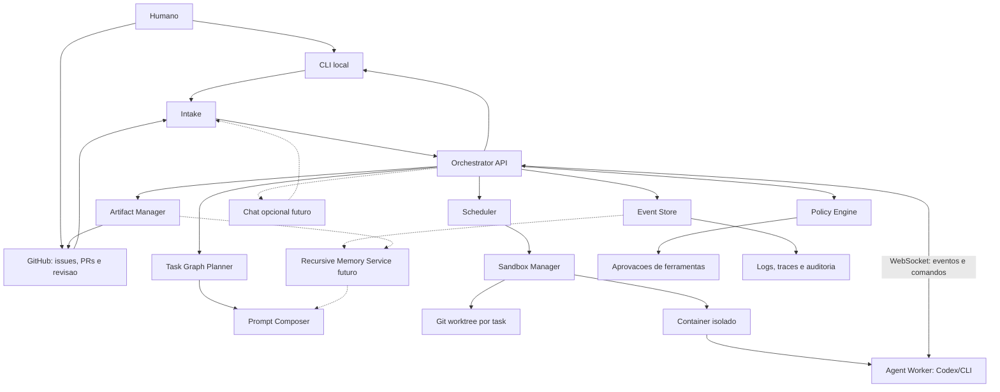

# Arquitetura do OrchestraOS

Este documento registra a arquitetura inicial do OrchestraOS a partir das decisoes tomadas em 2026-05-03.

## Contexto

O OrchestraOS sera um sistema de orquestracao de agentes capaz de executar multiplas tasks em paralelo. Cada agente deve trabalhar com contexto isolado, sandbox proprio e worktree separado por task.

O produto deve nascer local-first para desenvolvimento, mas com desenho pronto para rodar em servidor. A interface inicial sera CLI fina, com GitHub como superficie externa principal. O primeiro runtime de agente sera Codex/CLI em sandbox.

## Decisao Arquitetural

A arquitetura inicial sera um **control plane central com agent workers isolados**.

O Orchestrator administra tasks, permissoes, mensagens, estado, auditoria e ciclo de vida dos agentes. Os agentes executam trabalho em sandboxes separados e reportam eventos estruturados ao Orchestrator.

Agentes podem solicitar informacoes de outros agentes, mas a comunicacao deve ser mediada pelo Orchestrator para manter auditoria, politicas e controle de contexto.

## Principios

- Repositorio continua sendo a fonte de verdade.
- GitHub e CLI sao as interfaces operacionais iniciais.
- Chat e outras interfaces conversacionais sao conectores opcionais futuros, nao memoria definitiva.
- CLI e a primeira interface oficial do MVP; scripts sao bootstrap interno.
- Cada task deve ter worktree, branch, estado e trilha de auditoria.
- Cada task complexa deve ser decomposta em Task Graph aciclico.
- Prompts devem ser montados por fragmentos versionados e registrados em snapshot.
- Memoria recursiva deve ser camada derivada de eventos, checkpoints, ledger, artefatos e documentos versionados, nunca fonte canonica paralela.
- Toda acao relevante do agente deve gerar evento estruturado.
- Comunicacao entre agentes deve ser registrada e mediada.
- Permissoes de ferramentas devem seguir politica explicita.
- O sistema deve comecar pequeno, suportando 2 a 5 agentes paralelos.
- O desenho deve permitir evolucao para servidor sem reescrever o dominio.

## Documentos Relacionados

- [Stack inicial](stack.md)
- [Orquestracao de agentes](orchestration.md)
- [Modelo de dominio](domain-model.md)
- [Estrategia de interface](interface-strategy.md)
- [Decomposicao de tasks](task-decomposition.md)
- [Sistema de prompts](prompt-system.md)
- [Sistema de memoria recursiva](memory-system.md)
- [Protocolo de comunicacao](communication-protocol.md)
- [JSON Schemas](../contracts/json-schemas.md)
- [Permissoes e ferramentas](permissions.md)
- [Sandbox e autonomia](sandbox-and-autonomy.md)
- [Estrategia de testes](testing-strategy.md)
- [Falhas e rollback](failures-and-rollback.md)
- [MVP local-first](mvp.md)
- [Plano de implementacao](../implementation/roadmap.md)
- [ADR 0002: Orchestrator como control plane](../adr/0002-orchestrator-control-plane.md)
- [ADR 0003: Stack inicial](../adr/0003-initial-technology-stack.md)
- [ADR 0004: Sandbox e autonomia inicial](../adr/0004-sandbox-and-autonomy.md)
- [ADR 0005: Interface inicial do MVP](../adr/0005-mvp-interface-strategy.md)
- [ADR 0006: Decomposicao de tasks e intervencao em agentes](../adr/0006-task-graph-and-agent-intervention.md)
- [ADR 0007: Sistema de composicao de prompts](../adr/0007-prompt-composition-system.md)
- [ADR 0008: Ledger persistente de progresso](../adr/0008-agent-task-ledger.md)
- [ADR 0009: Normalizacao de historico e tracing](../adr/0009-trace-history-normalization.md)
- [ADR 0010: Operacao GitHub-first e chat opcional](../adr/0010-github-first-operations.md)
- [ADR 0011: Agent Checkpoints](../adr/0011-agent-checkpoints.md)
- [ADR 0012: Sistema de memoria recursiva](../adr/0012-recursive-memory-system.md)
- [ADR 0013: Escopo M0 de schemas e tipos de dominio](../adr/0013-m0-domain-contract-scope.md)

## Referencias Tecnicas

- OpenAI Agents SDK: https://developers.openai.com/api/docs/guides/agents
- OpenAI Agent orchestration: https://openai.github.io/openai-agents-python/multi_agent/
- Model Context Protocol: https://modelcontextprotocol.io/docs/learn/architecture
- Agent2Agent Protocol: https://github.com/a2aproject/A2A
- Temporal: https://docs.temporal.io/
- NATS JetStream: https://docs.nats.io/nats-concepts/jetstream
- Git worktree: https://git-scm.com/docs/git-worktree.html
- Docker security: https://docs.docker.com/engine/security/
- gVisor: https://gvisor.dev/docs/
- OpenTelemetry: https://opentelemetry.io/docs/
