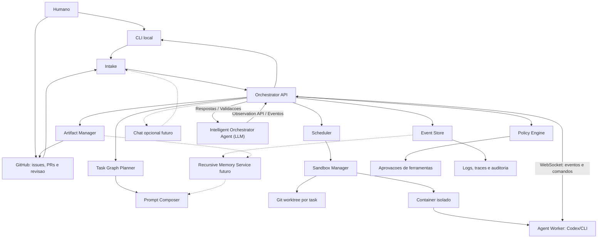

# Arquitetura do OrchestraOS

Este documento registra a arquitetura do OrchestraOS, refletindo a arquitetura de **Módulos Verticais (Vertical Slice Architecture)** conforme ADR 0022.

## Contexto

O OrchestraOS é um sistema de orquestração de agentes capaz de executar múltiplas tasks em paralelo. Cada agente trabalha com contexto isolado, sandbox próprio e worktree separada por task.

O produto é local-first para desenvolvimento, com desenho pronto para rodar em servidor. A interface inicial é CLI fina, com GitHub como superfície externa principal. O primeiro runtime de agente é Codex/CLI em sandbox.

## Arquitetura de Módulos Verticais

Conforme ADR 0022 (LLM-Optimized Module Architecture), o OrchestraOS adota uma arquitetura de **Módulos Verticais** para otimizar o sistema para operação por agentes de IA (LLMs). Cada entidade de domínio tem seu próprio módulo autônomo em `internal/modules/<entity>/`.

### Regra de Ouro

**Módulos verticais NUNCA importam outros módulos diretamente.** Comunicação cross-module ocorre via `internal/modules/orchestrator/` (camada de orquestração canônica) ou interfaces DI com adapters em `internal/bootstrap/services.go`.

### Estrutura

- **Módulos Verticais (`internal/modules/`)**: Cada módulo representa uma entidade de domínio (agent, task, run, workunit, etc.) com sua própria lógica, repositório, validação e contratos.
- **Core (`internal/core/`)**: Componentes compartilhados usados por todos os módulos (apperrors, db, eventstore, orchestration, statemachine, validation).
- **Domain (`internal/domain/`)**: Tipos compartilhados entre módulos que não pertencem a um único módulo vertical.
- **Bootstrap (`internal/bootstrap/`)**: Injeção de dependências e wiring de serviços com adapters para conectar módulos sem dependências diretas.

## Decisao Arquitetural

A arquitetura inicial sera um **control plane central hibrido com agent workers isolados**.

O OrchestraOS adota uma arquitetura de Orquestracao Hibrida com dois sistemas cooperativos:

1. **Sistema de Orquestracao Inteligente (LLM)**: Um Agente Orquestrador Inteligente que atua como intermediador estrategico. Ele toma decisoes de alto nivel (decomposicao, diagnostico, selecao de perfis, aprovacoes de risco), mas nunca executa codigo nem acessa servicos diretamente.

2. **Sistema de Orquestracao Deterministico (Go)**: O `OrchestratorService` como control plane central e gatekeeper. Ele valida e executa todas as operacoes, transiciona estados, gerencia sandboxes, controla o WebSocket e orquestra a comunicacao cross-module.

Os agentes executores (`code_worker`, `docs_writer`, `reviewer`, etc.) executam trabalho em sandboxes separadas e reportam eventos estruturados ao Orchestrator. Toda comunicacao cross-module passa obrigatoriamente pelo `OrchestratorService`.

Agentes podem solicitar informacoes de outros agentes, mas a comunicacao deve ser mediada pelo Orchestrator para manter auditoria, politicas e controle de contexto.

## Principios

- Repositorio continua sendo a fonte de verdade.
- GitHub e CLI sao as interfaces operacionais iniciais.
- Chat e outras interfaces conversacionais sao conectores opcionais futuros, nao memoria definitiva.
- CLI e a primeira interface oficial do MVP; scripts sao bootstrap interno.
- Cada task deve ter worktree, branch, estado e trilha de auditoria.
- Cada task complexa deve ser decomposta em Task Graph aciclico.
- Prompts devem ser montados por fragmentos versionados e registrados em snapshot.
- Memoria recursiva deve ser camada derivada de eventos, checkpoints, ledger, artefatos e documentos versionados, nunca fonte canonica paralela.
- Toda acao relevante do agente deve gerar evento estruturado.
- Comunicacao entre agentes deve ser registrada e mediada.
- Permissoes de ferramentas devem seguir politica explicita.
- O sistema deve comecar pequeno, suportando 2 a 5 agentes paralelos.
- O desenho deve permitir evolucao para servidor sem reescrever o dominio.

## Documentos Relacionados

- [Stack inicial](stack.md)
- [Orquestracao de agentes](orchestration.md)
- [Agente Orquestrador Inteligente](intelligent-orchestrator-agent.md)
- [Observation API](orchestrator-observation-api.md)
- [Protocolo de Intervencao](orchestrator-intervention-protocol.md)
- [Coordenacao Multi-Agente](multi-agent-coordination.md)
- [Modelo de dominio](domain-model.md)
- [Estrategia de interface](interface-strategy.md)
- [Decomposicao de tasks](task-decomposition.md)
- [Sistema de prompts](prompt-system.md)
- [Sistema de memoria recursiva](memory-system.md)
- [Protocolo de comunicacao](communication-protocol.md)
- [Estrutura inicial do repositorio](repo-structure.md)
- [JSON Schemas](../contracts/json-schemas.md)
- [Permissoes e ferramentas](permissions.md)
- [Sandbox e autonomia](sandbox-and-autonomy.md)
- [Estrategia de testes](testing-strategy.md)
- [Falhas e rollback](failures-and-rollback.md)
- [MVP local-first](mvp.md)
- [Proposta futura: Massive Agents System](massive-agents-system.md)
- [Plano de implementacao](../implementation/roadmap.md)
- [ADR 0002: Orchestrator como control plane](../adr/0002-orchestrator-control-plane.md)
- [ADR 0003: Stack inicial](../adr/0003-initial-technology-stack.md)
- [ADR 0004: Sandbox e autonomia inicial](../adr/0004-sandbox-and-autonomy.md)
- [ADR 0005: Interface inicial do MVP](../adr/0005-mvp-interface-strategy.md)
- [ADR 0006: Decomposicao de tasks e intervencao em agentes](../adr/0006-task-graph-and-agent-intervention.md)
- [ADR 0007: Sistema de composicao de prompts](../adr/0007-prompt-composition-system.md)
- [ADR 0008: Ledger persistente de progresso](../adr/0008-agent-task-ledger.md)
- [ADR 0009: Normalizacao de historico e tracing](../adr/0009-trace-history-normalization.md)
- [ADR 0010: Operacao GitHub-first e chat opcional](../adr/0010-github-first-operations.md)
- [ADR 0011: Agent Checkpoints](../adr/0011-agent-checkpoints.md)
- [ADR 0012: Sistema de memoria recursiva](../adr/0012-recursive-memory-system.md)
- [ADR 0013: Escopo M0 de schemas e tipos de dominio](../adr/0013-m0-domain-contract-scope.md)
- [ADR 0014: Persistencia M0, CLI minima e testes](../adr/0014-m0-cli-persistence-and-integration-tests.md)
- [ADR 0015: TUI como interface local primaria](../adr/0015-tui-as-primary-local-interface.md)
- [ADR 0016: State Machine event-sourced](../adr/0016-event-sourced-state-machine.md)
- [ADR 0022: LLM-Optimized Module Architecture](../adr/0022-llm-optimized-module-architecture.md)
- [ADR 0023: Hybrid Intelligent Orchestrator Architecture](../adr/0023-hybrid-intelligent-orchestrator.md)
- [ADR 0024: Deprecation of ADR 0017 - Domain Services Layer](../adr/0024-deprecation-of-adr-0017.md)
- [Migration to Vertical Slices](migration-vertical-slices.md)

## Referencias Tecnicas

- OpenAI Agents SDK: https://developers.openai.com/api/docs/guides/agents
- OpenAI Agent orchestration: https://openai.github.io/openai-agents-python/multi_agent/
- Model Context Protocol: https://modelcontextprotocol.io/docs/learn/architecture
- Agent2Agent Protocol: https://github.com/a2aproject/A2A
- Temporal: https://docs.temporal.io/
- NATS JetStream: https://docs.nats.io/nats-concepts/jetstream
- Git worktree: https://git-scm.com/docs/git-worktree.html
- Docker security: https://docs.docker.com/engine/security/
- gVisor: https://gvisor.dev/docs/
- OpenTelemetry: https://opentelemetry.io/docs/
