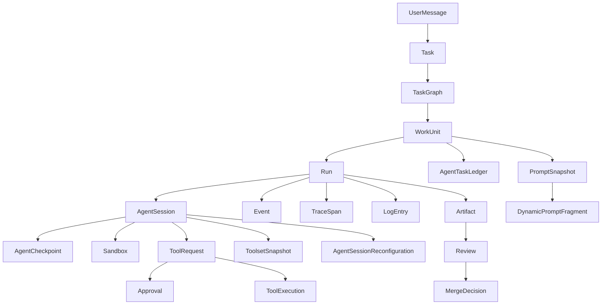

# Modelo de Dominio

Este documento define os modelos conceituais iniciais do OrchestraOS. O objetivo e guiar implementacao, banco de dados, eventos, schemas e testes sem amarrar detalhes prematuros de armazenamento.

## Fronteiras

| Fronteira | Responsabilidade |
| --- | --- |
| Intake | Receber mensagens humanas, comandos CLI, GitHub e conectores opcionais futuros. |
| Orchestration | Normalizar pedidos, decompor tasks, criar runs e coordenar agentes. |
| Planning | Criar task graph, work units, ownership e criterios de aceite. |
| Prompting | Montar system prompts, task prompts e snapshots auditaveis. |
| Agent Runtime | Executar agentes em sandboxes, loops, checkpoints e tools. |
| Policy | Decidir permissoes, riscos, aprovacoes e bloqueios. |
| Tracing | Persistir eventos, spans, logs, mensagens e artefatos. |
| Memory | Derivar, deduplicar, recuperar e auditar memorias com evidencia canonica. |
| Review | Validar evidencias, revisar diff e aprovar ou negar merge. |

## Entidades Principais

### UserMessage

Entrada humana recebida por CLI, GitHub, futura UI ou conector opcional.

Campos minimos:

- `id`
- `source`
- `author_id`
- `conversation_id`
- `text`
- `attachments`
- `created_at`

### ConversationThread

Agrupa mensagens relacionadas a uma task, run ou agente.

Campos minimos:

- `id`
- `source`
- `external_ref`
- `scope`
- `task_id`
- `run_id`
- `agent_id`

### Task

Unidade de trabalho de produto ou engenharia que pode gerar uma ou mais runs.

Campos minimos:

- `id`
- `title`
- `description`
- `status`
- `priority`
- `risk_level`
- `created_from_message_id`
- `acceptance_criteria`
- `created_at`
- `updated_at`

Estados recomendados seguem `docs/architecture/orchestration.md`.

### TaskGraph

Plano de decomposicao aciclico criado pelo Orchestrator.

Campos minimos:

- `id`
- `task_id`
- `version`
- `status`
- `created_by`
- `rationale`
- `created_at`

### WorkUnit

Node executavel do `TaskGraph`.

Campos minimos:

- `id`
- `task_graph_id`
- `title`
- `objective`
- `assigned_agent_profile`
- `status`
- `owned_paths`
- `read_paths`
- `acceptance_criteria`
- `validation_plan`
- `depends_on`

### Dependency

Edge do grafo.

Campos minimos:

- `from_work_unit_id`
- `to_work_unit_id`
- `type`
- `required_artifact`
- `reason`

Tipos iniciais:

- `blocks`
- `requires_artifact`
- `requires_review`
- `conflicts_with`

### Run

Tentativa concreta de executar uma task ou work unit.

Campos minimos:

- `id`
- `task_id`
- `work_unit_id`
- `status`
- `attempt`
- `started_at`
- `finished_at`
- `result`
- `failure_reason`

### Agent

Definicao logica de um agente disponivel.

Campos minimos:

- `id`
- `name`
- `profile`
- `capabilities`
- `allowed_tools`
- `default_prompt_fragments`
- `runtime_type`

### AgentSession

Execucao viva de um agente em uma run.

Campos minimos:

- `id`
- `agent_id`
- `run_id`
- `sandbox_id`
- `connection_id`
- `status`
- `last_heartbeat_at`
- `last_checkpoint_at`

### AgentCheckpoint

Snapshot estruturado de progresso em ponto seguro da sessao do agente.

Campos minimos:

- `id`
- `run_id`
- `work_unit_id`
- `agent_session_id`
- `sequence`
- `current_goal`
- `completed_goals`
- `pending_todos`
- `files_read`
- `files_modified`
- `evidence_refs`
- `decisions`
- `blockers`
- `risks`
- `minimal_summary`
- `next_goal_suggestion`
- `created_at`

### MemoryRecord

Memoria derivada de fontes canonicas para recuperacao de contexto. Nao e fonte de verdade.

Campos minimos:

- `id`
- `type`
- `domain`
- `scope`
- `title`
- `canonical_claim`
- `semantic_key`
- `cluster_id`
- `content`
- `evidence_refs`
- `confidence`
- `impact`
- `status`
- `content_hash`
- `embedding_ref`
- `supersedes`
- `created_at`

Tipos iniciais seguem `docs/architecture/memory-system.md`.

### RetrievedMemoryBundle

Conjunto pequeno e deduplicado de memorias selecionadas para uma `AgentSession` ou checkpoint.

Campos minimos:

- `id`
- `run_id`
- `agent_session_id`
- `work_unit_id`
- `query_reason`
- `memory_refs`
- `evidence_refs`
- `token_budget`
- `injected_at`
- `created_at`

### Sandbox

Ambiente isolado de execucao.

Campos minimos:

- `id`
- `run_id`
- `repo_id`
- `branch`
- `worktree_path`
- `container_id`
- `network_policy`
- `resource_limits`
- `status`

### ToolDefinition

Ferramenta conhecida pelo sistema.

Campos minimos:

- `id`
- `name`
- `category`
- `risk_class`
- `input_schema`
- `output_schema`
- `default_policy`

### ToolRequest

Pedido de uso de ferramenta feito por agente.

Campos minimos:

- `id`
- `run_id`
- `agent_id`
- `tool_id`
- `intent`
- `input`
- `risk_assessment`
- `status`
- `requested_at`

### ToolExecution

Resultado de uma ferramenta aprovada e executada.

Campos minimos:

- `id`
- `tool_request_id`
- `status`
- `started_at`
- `finished_at`
- `exit_code`
- `output_ref`
- `error`

### Policy

Regra versionada que determina permissoes.

Campos minimos:

- `id`
- `name`
- `version`
- `scope`
- `rules`
- `effective_from`
- `status`

### Approval

Decisao humana ou automatica sobre acao sensivel.

Campos minimos:

- `id`
- `subject_type`
- `subject_id`
- `decision`
- `decider`
- `reason`
- `expires_at`
- `created_at`

### Event

Registro canonico de fato operacional.

Campos minimos seguem o envelope em `docs/architecture/communication-protocol.md` e os schemas em `docs/contracts/json-schemas.md`.

### TraceSpan

Intervalo correlacionado de execucao para live view e diagnostico.

Campos minimos:

- `trace_id`
- `span_id`
- `parent_span_id`
- `name`
- `status`
- `started_at`
- `finished_at`
- `attributes`

### LogEntry

Linha ou bloco de log associado a run, tool ou agente.

Campos minimos:

- `id`
- `run_id`
- `agent_id`
- `level`
- `stream`
- `message`
- `redaction_status`
- `created_at`

### Artifact

Evidencia ou saida persistida.

Campos minimos:

- `id`
- `task_id`
- `run_id`
- `type`
- `path_or_uri`
- `checksum`
- `summary`
- `created_at`

Tipos iniciais:

- `diff`
- `patch`
- `test_report`
- `log_bundle`
- `prompt_snapshot`
- `task_summary`
- `review_note`

### PromptFragment

Bloco versionado usado na montagem de prompts.

Campos minimos:

- `id`
- `version`
- `kind`
- `title`
- `body`
- `applies_when`
- `requires`
- `conflicts_with`
- `priority`

### DynamicPromptFragment

Fragmento temporario criado pelo Orchestrator para especializar uma run especifica.

Campos minimos:

- `id`
- `run_id`
- `work_unit_id`
- `kind`
- `title`
- `body_hash`
- `reason`
- `expires_after_run`
- `created_at`

### PromptSnapshot

Registro imutavel do prompt montado para uma run.

Campos minimos:

- `id`
- `run_id`
- `system_prompt_hash`
- `task_prompt_hash`
- `fragment_refs`
- `dynamic_fragment_refs`
- `rendered_refs`
- `created_at`

### ToolsetSnapshot

Registro imutavel das ferramentas disponiveis para uma `AgentSession`.

Campos minimos:

- `id`
- `run_id`
- `agent_session_id`
- `tools`
- `created_reason`
- `created_at`

### AgentSessionReconfiguration

Registro de reinicio ou substituicao controlada de uma sessao por mudanca de prompt, toolset ou especializacao.

Campos minimos:

- `id`
- `run_id`
- `previous_agent_session_id`
- `next_agent_session_id`
- `reason`
- `prompt_snapshot_id`
- `toolset_snapshot_id`
- `ledger_preserved`
- `created_at`

### AgentTaskLedger

Memoria operacional persistente da work unit.

Campos minimos:

- `id`
- `work_unit_id`
- `run_id`
- `objective`
- `acceptance_criteria`
- `todos`
- `blockers`
- `risks`
- `current_summary`
- `next_checkpoint`
- `updated_at`

### Review

Analise final de diff, evidencias e riscos.

Campos minimos:

- `id`
- `task_id`
- `run_id`
- `reviewer`
- `decision`
- `findings`
- `required_changes`
- `created_at`

### MergeDecision

Decisao de integrar ou descartar alteracoes.

Campos minimos:

- `id`
- `task_id`
- `run_id`
- `decision`
- `target_branch`
- `reason`
- `rollback_plan`
- `created_at`

## Relacionamentos

## Regras de Modelagem

- Estado operacional vive no banco e no Event Store.
- Decisoes arquiteturais vivem em ADRs.
- GitHub guarda referencias externas, issues, PRs, checks e revisoes, mas nao substitui o repositorio como fonte de verdade.
- Chat guarda notificacoes e conversas quando existir conector, mas nao substitui o repositorio.
- Todo evento relevante deve ser correlacionavel por `task_id`, `run_id` e `trace_id` quando aplicavel.
- Entidades que afetam reproducibilidade devem ter versao ou snapshot.
