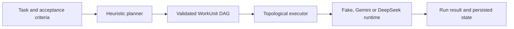

# OrchestraOS — reviewer guide

> **30-second summary:** OrchestraOS is a deliberately small Go control plane that turns acceptance criteria into a dependency graph and executes the resulting work units through a selected runtime.

## Why this repository matters

The strongest signal in OrchestraOS is not feature count. It is the architectural pivot from an oversized agent platform to a narrower executable pipeline with testable boundaries.

The repository demonstrates task decomposition, DAG construction, topological execution, provider adapters and architecture tests without claiming to be a complete autonomous software factory.

## Executable path



The primary code path is intentionally short:

1. `cmd/orchestraos/main.go` composes the CLI.
2. `internal/orchestrator.go` coordinates planning and execution.
3. `internal/planner/` converts criteria into a plan.
4. `internal/daggen/` builds and validates graph structure.
5. `internal/executor/executor.go` sorts dependencies and executes work units.
6. `internal/provider/` adapts Gemini and DeepSeek.
7. `internal/store/` defines persistence boundaries.

## Engineering evidence

| Signal | Repository evidence |
|---|---|
| Small dependency surface | `go.mod` currently has one direct external dependency |
| Deterministic graph validation | DAG builder and validator have focused tests |
| Failure-aware execution | Executor persists Run state and marks work units/tasks failed |
| Architecture enforcement | AST-based tests enforce dependency direction, domain purity, size budgets, SQL confinement and absence of mutable globals |
| Provider separation | Gemini and DeepSeek live behind runtime/provider boundaries |
| Documented decisions | ADRs record the original architecture, later pivots and the thin orchestrator decision |
| CI | Build, race tests, vet, lint and architecture gates run in GitHub Actions |

## Current limits

- Work units execute sequentially even when the graph would allow concurrency.
- The default fake runtime returns success and does not prove real task completion.
- Real provider output is not yet validated against acceptance criteria.
- CLI persistence is in memory.
- Semantic LLM decomposition, assignment, streaming and event modules are not fully composed into the main path.
- There is no isolated coding workspace, sandbox, policy engine or web control surface.
- The repository currently declares no reuse license.

## Important repository hygiene note

The project pivot removed the previous `internal/modules/*` and `internal/core/coordination/*` architecture. Issues or documentation that still reference those paths should be closed or marked historical so reviewers do not mistake them for active debt in the current codebase.

## Fast evaluation path

```bash
go build ./...
go test ./... -race -count=1
go vet ./...
make check
```

Then run the deterministic provider:

```bash
go build -o orchestraos ./cmd/orchestraos
./orchestraos run "Add authentication" \
  "Create login form" \
  "Add authentication service" \
  "[after: 1,2] Validate integration"
```

## Highest-value next milestones

- Validate outputs against acceptance criteria with an evaluator boundary.
- Execute independent DAG branches concurrently with bounded workers.
- Add a durable store implementation while preserving the current interfaces.
- Publish one trace showing plan, graph, run states, provider output and final evaluation.
- Decide and declare a license before presenting the repository as reusable open source.

## Suggested GitHub topics

`ai-agents`, `agent-orchestration`, `dag`, `task-planning`, `go`, `workflow-engine`, `agent-runtime`, `multi-agent`, `architecture-testing`, `llm`, `gemini`, `deepseek`

## Portfolio interpretation

OrchestraOS is the clearest proof in this portfolio that the author can reduce scope, reject premature architecture and preserve correctness through executable boundaries. It is smaller than PersonAgent and Evidrun, but its simplicity and green architecture gates make it easy for a reviewer to understand quickly.
