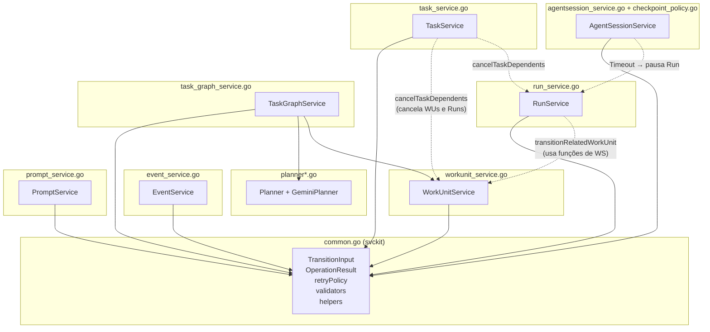

# Reorganização de `internal/services` em Sub-Pacotes LLM-Friendly

## Contexto

O pacote `internal/services` é um **pacote flat com 15 arquivos e ~4.700 linhas** que agrupa 7 subsistemas distintos. Quando uma LLM precisa trabalhar em um subsistema (ex: Planner), ela acaba carregando para o contexto TODOS os arquivos do pacote, incluindo ~3.500 linhas que não têm relação com a tarefa.

O problema não é só organização para humanos — é **eficiência de contexto para agentes LLM**. O objetivo desta reorganização é criar **ilhas de contexto** onde cada sub-pacote contém tudo que a LLM precisa para entender e operar naquele domínio, sem poluição.

### Princípio: Cada sub-pacote como uma "unidade de contexto" para LLMs

Uma LLM que precisa trabalhar em checkpoints **não precisa ler** o planner.
Uma LLM que precisa modificar o planner **não precisa entender** retry policies.

A estrutura proposta garante que: **abrir todos os arquivos de um sub-pacote = ter 100% do contexto necessário**.

## User Review Required

> [!IMPORTANT]
> Esta reorganização altera o import path de **todos os consumers** de `internal/services` — CLI, testes de integração e pacote `orchestration`. Embora os tipos públicos e assinaturas permaneçam idênticos, será um refactor transversal.

> [!WARNING]
> A ADR 0017 define os 5 serviços canônicos (`TaskService`, `RunService`, `WorkUnitService`, `AgentSessionService`, `EventService`). Esta reorganização **respeita** esses serviços mas os distribui em pacotes próprios. Se a ADR 0017 for considerada normativa quanto ao pacote único, precisamos revisá-la primeiro.

## Open Questions

1. **Preservar `services` como façade?** Podemos criar um `internal/services/services.go` que re-exporta todos os tipos dos sub-pacotes para manter backward compatibility temporária. Isso facilita a migração mas adiciona indireção. Recomendo **não fazer** e atualizar os imports diretamente — é mais limpo e a LLM entende melhor. O que prefere?

2. **Nome do pacote de utilidades compartilhadas:** Proponho `svckit` (service kit). Alternativas: `svcutil`, `servicecore`, `shared`. O nome `common` deve ser evitado pois não carrega semântica.

3. **`checkpoint_policy.go` pertence a `agentsession/` ou merece pacote próprio?** Hoje é um arquivo que estende `AgentSessionService` com métodos de checkpoint. Recomendo manter junto do `agentsession/` porque o `SuggestCheckpoint` e `AutomaticCheckpoint` são métodos do `AgentSessionService`. Concorda?

---

## Análise de Dependências (Grafo Atual)

Antes de propor a estrutura, identifiquei as dependências cruzadas entre os arquivos:



> [!NOTE]
> As linhas tracejadas representam **acoplamentos funcionais** — não são imports, porque tudo está no mesmo pacote. Esses são os pontos que precisam ser resolvidos na extração.

---

## Proposed Changes

### Estrutura Final

```
internal/services/
├── doc.go                      # Documentação do meta-pacote (1 arquivo, ~20 linhas)
│
├── svckit/                     # Kit compartilhado: types + helpers
│   ├── doc.go                  # "O que é svckit e quando usar"
│   ├── types.go                # TransitionInput, OperationResult, AppendResult
│   ├── validation.go           # validateRequiredUUID, validateOptionalUUID, etc.
│   ├── persistence.go          # beginTx, commitTx, rollbackTx, acquireAdvisoryTxLock
│   ├── transitions.go          # transitionPayload, requireFinalAudit, isFinalStatus
│   ├── retry.go                # retryPolicy, waitForRetryBackoff, intExtra
│   ├── events.go               # appendServiceEvent, marshalPayload, eventType helpers
│   └── entity_getters.go       # getTask, getWorkUnit, getRun, getAgentSession
│
├── event/                      # EventService
│   ├── doc.go
│   └── service.go              # EventService completo
│
├── task/                        # TaskService
│   ├── doc.go
│   └── service.go              # TaskService + cancelTaskDependents
│
├── workunit/                    # WorkUnitService
│   ├── doc.go
│   ├── service.go              # WorkUnitService principal
│   └── validation.go           # validateWorkUnitDependencies, pathsOverlap, etc.
│
├── run/                         # RunService
│   ├── doc.go
│   └── service.go              # RunService + transitionRelatedWorkUnit
│
├── agentsession/                # AgentSessionService + checkpoint policy
│   ├── doc.go
│   ├── service.go              # AgentSessionService principal
│   └── checkpoint.go           # SuggestCheckpoint, AutomaticCheckpoint, etc.
│
├── planner/                     # Planner interface + implementações
│   ├── doc.go
│   ├── planner.go              # Interface Planner + GraphPlan
│   ├── gemini.go               # GeminiPlanner
│   ├── prompt.go               # PlannerPrompt, BuildPlannerPrompt, profiles
│   └── validator.go            # ValidateGraphPlan
│
├── taskgraph/                   # TaskGraphService (orquestração de decomposição)
│   ├── doc.go
│   ├── service.go              # TaskGraphService.Decompose
│   └── heuristic.go            # buildLocalHeuristicGraphPlan + funções auxiliares
│
└── prompt/                      # PromptService
    ├── doc.go
    └── service.go               # PromptService completo
```

### Contagem de contexto por sub-pacote (estimativa)

| Sub-pacote | Arquivos | Linhas | LLM lê tudo? |
|---|---|---|---|
| `svckit/` | 8 | ~500 | Só quando precisa de helpers |
| `event/` | 2 | ~290 | ✅ auto-contido |
| `task/` | 2 | ~280 | ✅ + svckit |
| `workunit/` | 3 | ~520 | ✅ + svckit |
| `run/` | 2 | ~440 | ✅ + svckit |
| `agentsession/` | 3 | ~960 | ✅ + svckit |
| `planner/` | 5 | ~535 | ✅ 100% auto-contido |
| `taskgraph/` | 3 | ~650 | ✅ + svckit + planner types |
| `prompt/` | 2 | ~310 | ✅ + svckit |

**Antes:** LLM carrega ~4.700 linhas para qualquer tarefa.
**Depois:** LLM carrega ~300-960 linhas por tarefa + ~500 de svckit quando necessário. Redução de **60-85% de contexto irrelevante**.

---

### O papel do `doc.go` (crítico para LLMs)

Cada sub-pacote terá um `doc.go` que serve como **briefing de contexto** para a LLM. Formato padronizado:

```go
// Package planner implements task decomposition into directed acyclic graphs
// (DAGs) of WorkUnits.
//
// # Responsibility
// Transforms a domain.Task into a GraphPlan containing WorkUnits, nodes,
// edges and a rationale. Two strategies are available: GeminiPlanner (LLM)
// and local heuristic (inside taskgraph/).
//
// # Key Types
//   - Planner: interface that any decomposition strategy must implement
//   - GraphPlan: result struct with graph ID, work units, nodes and edges
//   - GeminiPlanner: concrete implementation using Gemini API
//
// # Dependencies
//   - domain: WorkUnit, Task, TaskGraphNodeInfo, TaskGraphEdgeInfo
//   - apperrors: error typing
//   - genai: Google Gemini SDK (only in gemini.go)
//
// # Related Packages
//   - taskgraph/: orchestrates decomposition lifecycle, persists results
//   - svckit/: shared validation and persistence helpers
package planner
```

Este `doc.go` permite que a LLM, ao abrir o pacote, entenda imediatamente:
1. **O que faz** → decide se precisa ler os outros arquivos
2. **Tipos principais** → sabe o que procurar
3. **Dependências** → sabe quais outros pacotes pode precisar consultar
4. **Pacotes relacionados** → navegação intencional, não fishing

---

### Resolução de Acoplamentos Cruzados

#### `RunService` → `WorkUnitService` (transitionRelatedWorkUnit)

A função `transitionRelatedWorkUnit` atualmente chama `validateDependenciesCompleted` e `validateOwnedPathAvailability` que são internas de `workunit_service.go`.

**Solução:** Extrair essas validações para `workunit/validation.go` e exportá-las. O `RunService` importa `workunit` para chamar validações mas **não** importa o service inteiro — importa funções de validação puras.

#### `TaskService` → `cancelTaskDependents`

A função cascata cancela WorkUnits e Runs. Atualmente usa repos diretamente.

**Solução:** Manter a lógica dentro de `task/service.go`, importando repos diretamente (como já faz). Não precisa chamar `WorkUnitService` ou `RunService` — usa repo + event append diretamente, preservando atomicidade transacional.

#### `AgentSessionService.Timeout` → pausa Run

**Solução:** `agentsession/service.go` importa `svckit` para helpers de transição e usa repo/event append diretamente para pausar o run. Não precisa do `RunService` — faz a operação atômica na mesma transaction.

---

### Componente `svckit/` (Service Kit)

O `svckit` é o **único pacote que todos importam**. Ele contém:

1. **Types**: `TransitionInput`, `OperationResult[T]`, `AppendResult`
2. **Validation**: `ValidateRequiredUUID`, `ValidateOptionalUUID`, `ValidateRequiredText`, `ValidateStringList`, `ValidatePriority`, `ValidateRiskLevel`
3. **Persistence**: `BeginTx`, `CommitTx`, `RollbackTx`, `AcquireAdvisoryTxLock`, `EnsureRowsAffected`
4. **Events**: `AppendServiceEvent`, `MarshalPayload`, `EventTypeFor*`
5. **Transitions**: `TransitionPayload`, `RequireFinalAudit`, `IsFinalStatus`, `TransitionContext`
6. **Retry**: `RetryPolicy`, `WaitForRetryBackoff`
7. **Entity Getters**: `GetTask`, `GetWorkUnit`, `GetRun`, `GetAgentSession`

> [!NOTE]
> Atualmente essas funções são unexported (`beginTx`, `getTask`). Na extração elas serão **exportadas** (`BeginTx`, `GetTask`) pois precisam ser acessíveis pelos sub-pacotes.

---

### Consumers que precisam de atualização de imports

| Consumer | Import Atual | Imports Novos |
|---|---|---|
| `cmd/orchestraos/cmd/task.go` | `services` | `task`, `svckit` |
| `cmd/orchestraos/cmd/workunit.go` | `services` | `workunit`, `svckit` |
| `cmd/orchestraos/cmd/run.go` | `services` | `run`, `svckit` |
| `cmd/orchestraos/cmd/event.go` | `services` | `event` |
| `cmd/orchestraos/cmd/agentsession.go` | `services` | `agentsession`, `svckit` |
| `cmd/orchestraos/cmd/run_test.go` | `services` | `run`, `svckit` |
| `internal/orchestration/commands.go` | `services` | `task`, `workunit`, `run`, `agentsession`, `taskgraph`, `prompt`, `svckit` |
| `tests/integration/*.go` | `services` | Vários, conforme uso |

---

## Estratégia de Migração

A migração deve ser **incremental e verificável** (conforme AGENTS.md: "mudanças pequenas, verificáveis e reversíveis"):

### Fase 1: Extração do `svckit/` + `planner/` (zero-risk)
- Criar `svckit/` com funções exportadas
- Criar `planner/` com interface + GeminiPlanner
- Manter `services/` original intacto compilando (ambos coexistem temporariamente)
- ✅ `go build ./...` + testes

### Fase 2: Extração dos serviços de lifecycle (`event/`, `task/`, `workunit/`)
- Criar sub-pacotes importando `svckit/`
- Atualizar consumers incrementalmente
- ✅ `go build ./...` + testes após cada serviço

### Fase 3: Extração dos serviços de execução (`run/`, `agentsession/`)
- Resolver acoplamentos com `workunit/validation.go`
- ✅ `go build ./...` + testes

### Fase 4: Extração de `taskgraph/` e `prompt/`
- `taskgraph/` importa `planner` para types
- ✅ `go build ./...` + testes

### Fase 5: Limpeza
- Remover `services/common.go` e arquivos migrados
- Verificar que nenhum import antigo sobrevive
- ✅ `go build ./...` + testes de integração completos

### Fase 6: ADR + doc.go
- Registrar ADR 0022 documentando a decisão
- Escrever `doc.go` em cada sub-pacote
- Atualizar roadmap se necessário

---

## Verification Plan

### Automated Tests

```bash
# Após cada fase:
go build ./...
go vet ./...
go test ./internal/services/... -v
go test ./tests/integration/... -v -count=1
```

### Manual Verification

- Confirmar que `go doc ./internal/services/planner/` mostra documentação coerente
- Confirmar que `go doc ./internal/services/svckit/` mostra API exportada limpa
- Validar que nenhum import circular existe: `go vet ./...`
